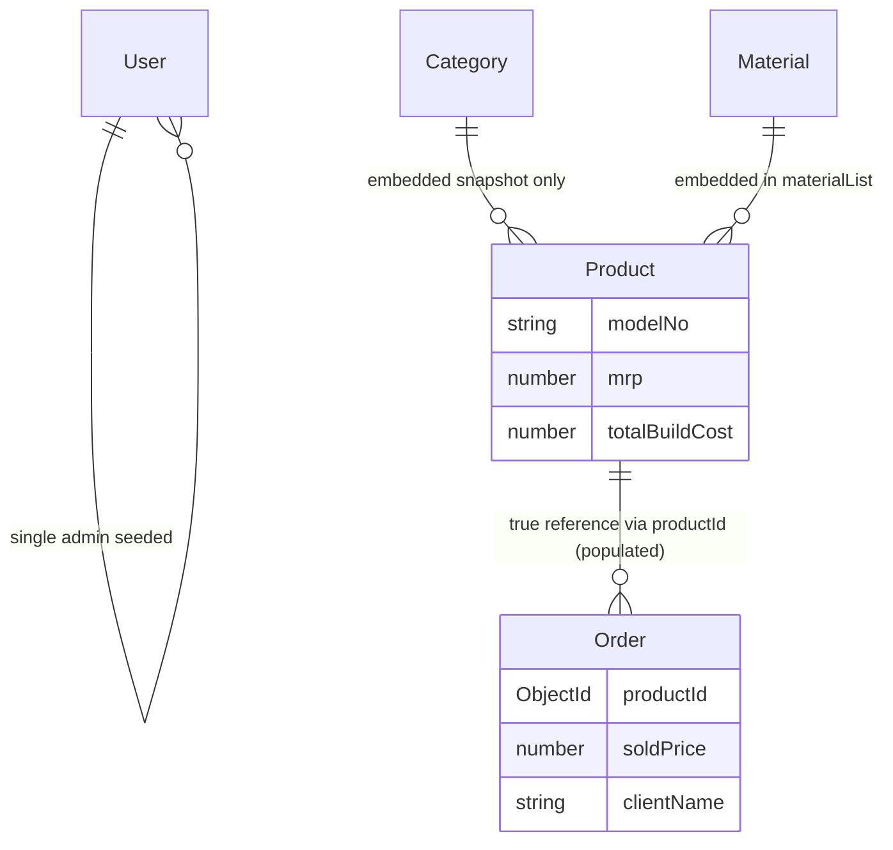
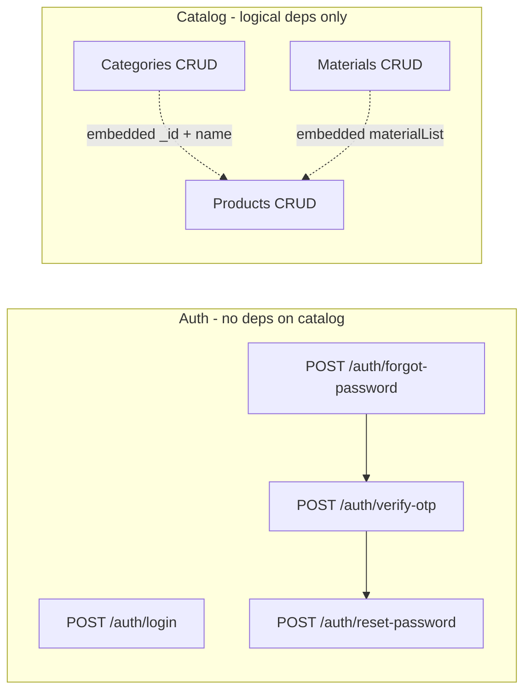
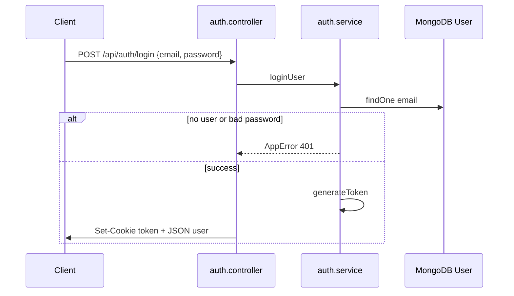
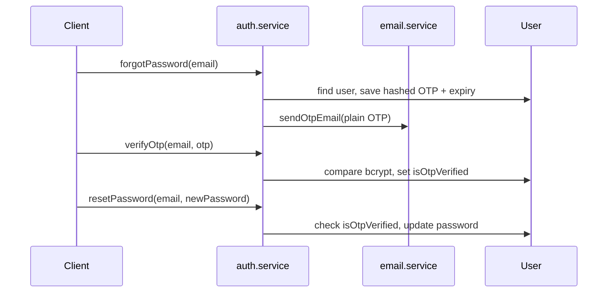
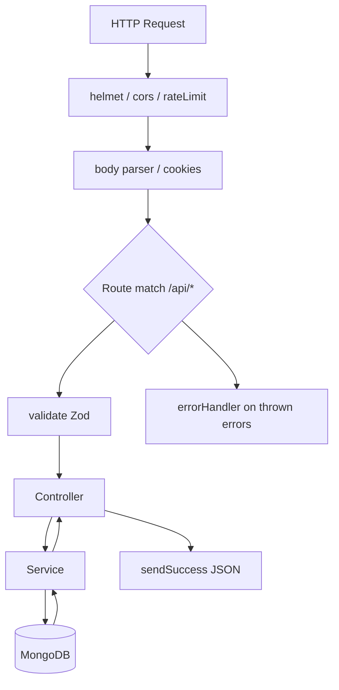
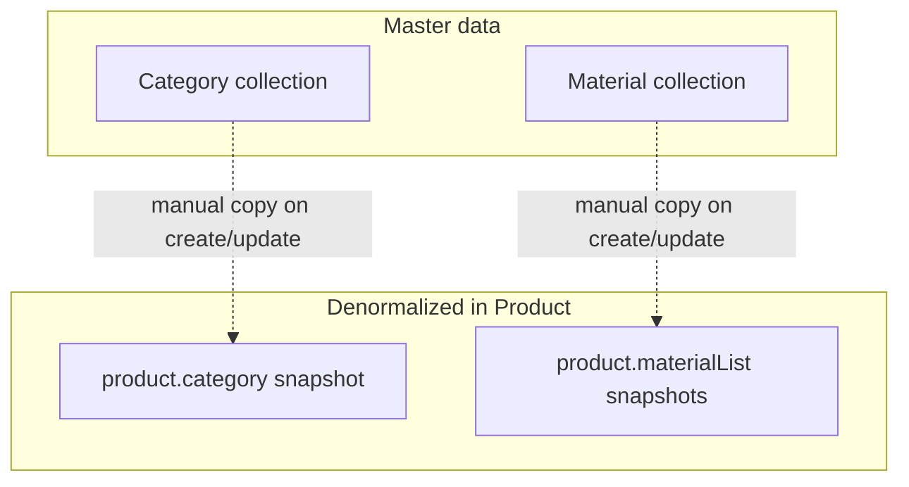

# Livilon Backend — Complete Technical Documentation

> **Document purpose:** Internal engineering reference for the Livilon Furniture Manufacturing Admin Backend.  
> **Codebase scope:** All files under repository root as of analysis (46 tracked source/config files; no Docker/K8s/CI configs present).  
> **Accuracy note:** Behavior described here is traced from actual code. Where documentation (`API_DOCS.md`) disagrees with code, **code wins** and discrepancies are called out explicitly.  
> **Last updated:** `authMiddleware` is now enabled on all catalog route files (`category`, `material`, `product`). All catalog CRUD endpoints now require a valid JWT cookie. **New modules added:** Order CRUD (`/api/orders`) and Dashboard analytics + reports (`/api/dashboard`, including CSV/PDF export via `pdfkit`). The Product `materialList[]` item shape was extended with required `quantity` and `totalPrice` fields.

---

## Table of Contents

1. [Project Overview](#project-overview)
2. [Tech Stack](#tech-stack)
3. [Folder Structure](#folder-structure)
4. [Architecture Overview](#architecture-overview)
5. [Environment Variables](#environment-variables)
6. [Database Design](#database-design)
7. [Authentication & Authorization](#authentication--authorization)
8. [API Documentation](#api-documentation)
9. [Detailed Workflow Documentation](#detailed-workflow-documentation)
10. [Middleware Explanation](#middleware-explanation)
11. [Services and Utilities](#services-and-utilities)
12. [Background Jobs / Queues](#background-jobs--queues)
13. [External Integrations](#external-integrations)
14. [Error Handling](#error-handling)
15. [Security Overview](#security-overview)
16. [Important Business Logic](#important-business-logic)
17. [Data Flow Diagrams](#data-flow-diagrams)
18. [Request Lifecycle Explanation](#request-lifecycle-explanation)
19. [Deployment/Infrastructure Notes](#deploymentinfrastructure-notes)
20. [Technical Debt & Improvement Suggestions](#technical-debt--improvement-suggestions)
21. [Glossary of Important Functions and Modules](#glossary-of-important-functions-and-modules)
22. [Appendix A: High-Level Flow Summary](#appendix-a-high-level-flow-summary)
23. [Appendix B: Critical Modules Summary](#appendix-b-critical-modules-summary)
24. [Appendix C: New Developer Onboarding Guide](#appendix-c-new-developer-onboarding-guide)
25. [Appendix D: Most Important Files to Study First](#appendix-d-most-important-files-to-study-first)
26. [Appendix E: Potential Bug / Security Risk Areas](#appendix-e-potential-bug--security-risk-areas)

---

# Project Overview

**Livilon Backend** (`livilon-backend` v1.0.0) is a TypeScript/Express REST API for a **furniture manufacturing admin panel**. It provides:

- **Admin authentication** (login + forgot-password OTP flow via email)
- **CRUD for product categories** (name + image path/key)
- **CRUD for materials** (business `materialId`, name, price)
- **CRUD for products** (model number, MRP, build cost, embedded material list, embedded category snapshot, image path array)

There is **no public customer storefront API**, **no multi-tenant support**, **no role-based permissions**, **no file upload server**, **no payments**, **no WebSockets**, and **no job queues** in this repository.

**Entry point:** `src/server.ts` → connects MongoDB → listens on `env.PORT` bound to `0.0.0.0`.

**API prefix:** `/api` (mounted in `src/app.ts`).

**Existing human-written API reference:** `API_DOCS.md` (partially outdated regarding route protection).

---

# Tech Stack

| Layer | Technology | Version (package.json) |
|-------|------------|------------------------|
| Runtime | Node.js | (not pinned in repo) |
| Language | TypeScript | ^5.5.4 |
| HTTP framework | Express | ^4.21.0 |
| Database ODM | Mongoose | ^8.6.0 |
| Database | MongoDB | via `MONGODB_URI` |
| Validation | Zod | ^3.23.8 |
| Auth tokens | jsonwebtoken | ^9.0.2 |
| Password hashing | bcryptjs | ^12 rounds in code |
| Email | nodemailer | ^6.9.14 |
| PDF generation | pdfkit | ^0.x (added for sales report export) |
| Security headers | helmet | ^7.1.0 |
| CORS | cors | ^2.8.5 |
| Cookies | cookie-parser | ^1.4.6 |
| Rate limiting | express-rate-limit | ^7.4.0 |
| Config | dotenv + Zod schema | dotenv ^16.4.5 |
| Dev server | ts-node-dev | ^2.0.0 |

**Build:** `tsc` → output `dist/`  
**Run prod:** `node dist/server.js`  
**Seed admin:** `npm run seed` → `node dist/scripts/seed.js` (requires prior `npm run build`)

---

# Folder Structure

```
Livilon_Backend/
├── .env.example              # Env template (includes ADMIN_* seed vars)
├── .gitignore
├── API_DOCS.md               # Hand-written API summary (protection status outdated)
├── package.json
├── package-lock.json
├── tsconfig.json
└── src/
    ├── server.ts             # Process entry: DB connect + listen
    ├── app.ts                # Express app wiring (middleware, routes, error handler)
    ├── config/
    │   ├── db.ts             # mongoose.connect
    │   └── env.ts            # Zod-validated environment
    ├── constants/
    │   ├── httpStatus.ts
    │   └── messages.ts
    ├── controllers/          # HTTP adapters (try/catch → next(error))
    │   ├── auth.controller.ts
    │   ├── category.controller.ts
    │   ├── dashboard.controller.ts
    │   ├── material.controller.ts
    │   ├── order.controller.ts
    │   └── product.controller.ts
    ├── middlewares/
    │   ├── auth.middleware.ts      # JWT cookie verification (NOT mounted on routes)
    │   ├── errorHandler.middleware.ts
    │   └── validate.middleware.ts
    ├── models/               # Mongoose schemas
    │   ├── user.model.ts
    │   ├── category.model.ts
    │   ├── material.model.ts
    │   ├── order.model.ts
    │   └── product.model.ts
    ├── routes/
    │   ├── index.ts          # Aggregates /auth, /categories, /materials, /products, /orders, /dashboard
    │   ├── auth.routes.ts
    │   ├── category.routes.ts
    │   ├── dashboard.routes.ts
    │   ├── material.routes.ts
    │   ├── order.routes.ts
    │   └── product.routes.ts
    ├── scripts/
    │   └── seed.ts           # One-time admin user creation
    ├── services/             # Business logic + DB access
    │   ├── auth.service.ts
    │   ├── category.service.ts
    │   ├── dashboard.service.ts
    │   ├── email.service.ts
    │   ├── material.service.ts
    │   ├── order.service.ts
    │   └── product.service.ts
    ├── types/
    │   └── index.ts          # TS interfaces for documents & API shapes
    ├── utils/
    │   ├── apiResponse.util.ts
    │   ├── cookie.util.ts
    │   ├── customError.ts
    │   ├── otp.util.ts
    │   ├── password.util.ts
    │   └── token.util.ts
    └── validations/          # Zod schemas per domain
        ├── auth.validation.ts
        ├── category.validation.ts
        ├── dashboard.validation.ts
        ├── material.validation.ts
        ├── order.validation.ts
        └── product.validation.ts
```

**Not present in repo:** `tests/`, `docker/`, `.github/workflows/`, Kubernetes manifests, upload controllers, WebSocket servers, worker processes.

---

# Architecture Overview

## Style

**Layered MVC-style Express application** with thin controllers, service layer for business/DB operations, Mongoose models for persistence, and Zod for request validation.

```
Client
  → Express global middleware (helmet, cors, rateLimit, json, cookies)
  → Route-specific middleware (validate Zod schema)
  → Controller (HTTP status + sendSuccess)
  → Service (queries, AppError throws)
  → Mongoose Model → MongoDB
  → errorHandler.middleware (centralized errors)
```

## Module boundaries

| Module | Responsibility |
|--------|----------------|
| `routes/*` | URL mapping, middleware chain |
| `controllers/*` | Extract req data, call service, format response |
| `services/*` | Business rules, DB operations |
| `models/*` | Schema, indexes, constraints |
| `validations/*` | Request shape validation |
| `middlewares/*` | Cross-cutting HTTP concerns |
| `utils/*` | Pure helpers (JWT, bcrypt, cookies, responses) |
| `config/*` | Boot-time configuration |

## Design patterns observed

- **Service layer** for domain operations
- **Operational errors** via `AppError` class
- **Uniform API envelope** via `sendSuccess` / `sendError`
- **Schema validation** via Zod + `validate` middleware factory
- **Embedded documents** in Product for category snapshot and material line items (denormalized)
- **Sliding JWT session** implemented in `authMiddleware` (but currently unused)

## Coupling notes

- Products store **copies** of category name and material names/prices; no Mongoose `populate()` on reads; updates to Category/Material do **not** cascade to existing Products.
- `authMiddleware` is now mounted on every catalog router via `router.use(authMiddleware)`; all catalog CRUD operations require a valid `token` cookie.
- `CORS_ORIGIN` in `env.ts` is **never applied** in `app.ts` (hardcoded `origin: "*"`).

---

# Environment Variables

Validated at startup in `src/config/env.ts` via Zod (`safeParse` → `process.exit(1)` on failure).

| Variable | Required | Default | Used in |
|----------|----------|---------|---------|
| `PORT` | No | `5000` | `server.ts` |
| `NODE_ENV` | No | `development` | `cookie.util.ts` (secure/sameSite) |
| `MONGODB_URI` | **Yes** | — | `db.ts`, `seed.ts` |
| `JWT_SECRET` | **Yes** | — | `token.util.ts` |
| `JWT_EXPIRES_IN` | No | `15d` | `token.util.ts` |
| `CORS_ORIGIN` | No | `http://localhost:3000` | **Not used in code** |
| `SMTP_HOST` | No | `smtp.gmail.com` | `email.service.ts` |
| `SMTP_PORT` | No | `587` | `email.service.ts` |
| `SMTP_USER` | No | `''` | `email.service.ts` |
| `SMTP_PASS` | No | `''` | `email.service.ts` |

**Seed-only variables** (in `.env.example`, read directly from `process.env` in `seed.ts`, **not** in `env.ts` schema):

| Variable | Purpose |
|----------|---------|
| `ADMIN_USER_ID` | Business ID for admin user |
| `ADMIN_EMAIL` | Admin login email |
| `ADMIN_MOBILE` | Admin mobile |
| `ADMIN_PASSWORD` | Plain password hashed on seed |

---

# Database Design

**Database:** MongoDB (single connection via Mongoose).

## Collections (Mongoose models)

### `User` (`src/models/user.model.ts`)

| Field | Type | Constraints | Notes |
|-------|------|-------------|-------|
| `userId` | String | required, unique | Business identifier (e.g. `ADMIN001`) |
| `email` | String | required, unique, lowercase | Login identifier |
| `mobile` | String | required | Not used in API flows |
| `password` | String | required | bcrypt hash |
| `otp` | String | optional | bcrypt hash of 6-digit OTP |
| `otpExpiry` | Date | optional | 10 min from generation |
| `isOtpVerified` | Boolean | default false | Gate for `resetPassword` |
| `createdAt` / `updatedAt` | Date | timestamps | auto |

### `Category` (`src/models/category.model.ts`)

| Field | Type | Constraints |
|-------|------|-------------|
| `name` | String | required |
| `image` | String | required (stored as path/key string, not binary) |
| timestamps | Date | auto |

### `Material` (`src/models/material.model.ts`)

| Field | Type | Constraints |
|-------|------|-------------|
| `materialId` | String | required, **unique** (business code e.g. `MAT001`) |
| `name` | String | required |
| `price` | Number | required, min 0 |
| timestamps | Date | auto |

### `Product` (`src/models/product.model.ts`)

| Field | Type | Constraints |
|-------|------|-------------|
| `modelNo` | String | required |
| `name` | String | required |
| `images` | String[] | default `[]` (URLs/paths only) |
| `mrp` | Number | required, min 0 |
| `materialList` | Subdoc[] | `materialId` → ObjectId ref Material, `name`, `price` (≥0), `quantity` (≥1, required), `totalPrice` (≥0, required, client-supplied line total) |
| `totalBuildCost` | Number | default 0 |
| `category` | Subdoc | `_id` → ObjectId ref Category, `name` |
| timestamps | Date | auto |

**Index:** `productSchema.index({ name: 'text', modelNo: 'text' })` — note list/search uses `$regex`, not `$text` search.

### `Order` (`src/models/order.model.ts`)

| Field | Type | Constraints |
|-------|------|-------------|
| `referenceImages` | String[] | default `[]` (image paths/keys, same convention as `Product.images`) |
| `productId` | ObjectId | required, **ref `Product`** (referential — populated on read; not a denormalized snapshot) |
| `clientName` | String | optional, trimmed |
| `soldPrice` | Number | required, min 0 |
| timestamps | Date | auto |

**Indexes:** `{ createdAt: -1 }` (list ordering + date-range report queries) and `{ productId: 1 }` (top-products `$group` + foreign lookups).

**Design note:** unlike `Product` (which embeds category/material snapshots), `Order` stores a **true reference** to `Product` via `Schema.Types.ObjectId, ref: 'Product'` and reads use Mongoose `populate`. This was a deliberate choice — orders need live product data for reporting/dashboard analytics, and the existing snapshot pattern would have made aggregations and joins (`$lookup` in dashboard) less reliable.

## Entity relationship (logical)



**No foreign-key enforcement** at application level when deleting Category/Material — Product documents retain stale embedded data. **Order, however,** validates `productId` existence on create/update in `order.service.ts` (production-safe guard added with the new module). Deleting a Product still does not cascade to Orders; Orders referencing a deleted Product will return `product: null` from dashboard `$lookup` queries and a `null`-like populated value from `populate('productId')`.

---

# Authentication & Authorization

## Authentication mechanism

1. **Login** (`POST /api/auth/login`): validates email/password against `User`, issues JWT via `generateToken({ id, email })`, sets HTTP-only cookie `token`.
2. **Subsequent requests:** `authMiddleware` (if enabled) reads `req.cookies.token`, verifies JWT, reloads user from DB, optionally **refreshes** cookie (sliding session).
3. **JWT payload:** `{ id: string, email: string }` signed with `JWT_SECRET`, expiry `JWT_EXPIRES_IN` (default 15d).
4. **Cookie options** (`cookie.util.ts`): `httpOnly: true`, `secure` in production, `sameSite` strict/lax, `maxAge` 15 days, `path: '/'`.

## Authorization

- **No roles**, **no permissions**, **no admin vs user distinction** in code beyond "only users in DB can login."
- **Single admin** intended via `seed.ts`.
- **Catalog protection (current state):** `authMiddleware` is mounted at the top of `category.routes.ts`, `material.routes.ts`, and `product.routes.ts` via `router.use(authMiddleware)`. Every category, material, and product endpoint now requires a valid `token` HTTP-only cookie obtained from `POST /api/auth/login`. Requests without the cookie return `401 Access token is missing`; invalid/expired tokens return `401 Access token is invalid or expired`. The middleware also re-issues a fresh cookie on every authenticated request (sliding 15-day session).

## Password reset (OTP) flow

1. `forgotPassword` → generates 6-digit OTP, stores **bcrypt hash** in `user.otp`, sets `otpExpiry` (+10 min), `isOtpVerified = false`, emails plain OTP.
2. `verifyOtp` → compares OTP, clears `otp`/`otpExpiry`, sets `isOtpVerified = true`.
3. `resetPassword` → requires `isOtpVerified`, hashes new password, clears flag.

## Missing auth features (not in codebase)

- Logout endpoint
- Signup/register API (admin only via seed)
- Token refresh endpoint (only via disabled middleware sliding refresh)
- Role-based access control

---

# API Documentation

**Base URL:** `http://<host>:<PORT>/api`  
**Global rate limit:** 100 requests / 15 minutes per IP (`app.ts`).  
**Standard success envelope:**

```json
{ "success": true, "message": "...", "data": <optional> }
```

**Standard error envelope:**

```json
{ "success": false, "message": "...", "data": null | validation array }
```

---

## Non-API routes (app-level)

| # | Method | Path | Middleware | Handler | Auth | Response |
|---|--------|------|------------|---------|------|----------|
| 1 | GET | `/health` | helmet, cors, rateLimit, json, cookies | inline | None | `{ success: true, message: "Server is running" }` |
| 2 | GET | `/` | same | inline | None | `"Hello Afreen"` plain text |

---

## Auth routes (`/api/auth`)

### 1. POST `/api/auth/login`

| Aspect | Detail |
|--------|--------|
| **Controller** | `authController.login` |
| **Middleware** | `validate(loginSchema)` |
| **Body** | `{ email: string, password: string }` |
| **Auth** | None |
| **Service** | `authService.loginUser` |
| **DB** | `User.findOne({ email })`, bcrypt compare |
| **External** | None |
| **Success** | 200, sets `token` cookie, `data`: `{ id, email, userId }` |
| **Errors** | 401 `Invalid email or password` (user missing or wrong password) |

**Lifecycle:**

```
Request → validate(loginSchema) → login → loginUser
  → find user → comparePassword → generateToken
  → res.cookie('token') → sendSuccess(200)
```

---

### 2. POST `/api/auth/forgot-password`

| Aspect | Detail |
|--------|--------|
| **Controller** | `authController.forgotPassword` |
| **Middleware** | `validate(forgotPasswordSchema)` |
| **Body** | `{ email: string }` |
| **Service** | `authService.forgotPassword` |
| **DB** | Update user: `otp`, `otpExpiry`, `isOtpVerified=false` |
| **External** | `sendOtpEmail` (nodemailer) |
| **Success** | 200, message `OTP sent to your email`, no `data` |
| **Errors** | 404 `User not found` |

---

### 3. POST `/api/auth/verify-otp`

| Aspect | Detail |
|--------|--------|
| **Controller** | `authController.verifyOtp` |
| **Middleware** | `validate(verifyOtpSchema)` |
| **Body** | `{ email, otp }` (otp exactly 6 chars) |
| **Service** | `authService.verifyOtp` |
| **DB** | Read user; on expiry clear OTP fields; on success set `isOtpVerified=true`, clear otp fields |
| **Success** | 200 `OTP verified successfully` |
| **Errors** | 404 user not found; 400 invalid/expired OTP |

---

### 4. POST `/api/auth/reset-password`

| Aspect | Detail |
|--------|--------|
| **Controller** | `authController.resetPassword` |
| **Middleware** | `validate(resetPasswordSchema)` |
| **Body** | `{ email, newPassword }` (6–128 chars) |
| **Service** | `authService.resetPassword` |
| **DB** | Requires `isOtpVerified`; updates `password`, clears flag |
| **Success** | 200 `Password reset successful` |
| **Errors** | 404 user; 400 `Please verify OTP before resetting password` |

---

## Category routes (`/api/categories`)

> **Auth:** **Protected.** `router.use(authMiddleware)` runs before every handler. Requests must include the `token` cookie issued at login. Returns `401` if missing/invalid.

### 5. POST `/api/categories`

| Aspect | Detail |
|--------|--------|
| **Controller** | `categoryController.create` |
| **Middleware** | `authMiddleware` → `validate(createCategorySchema)` |
| **Auth** | Required (JWT cookie) |
| **Body** | `{ name: string, image: string }` |
| **Service** | `categoryService.createCategory` → `Category.create` |
| **Success** | 201 + category document (and refreshed `token` cookie) |
| **Errors** | 401 missing/invalid token; 400 validation; 500 unhandled |

---

### 6. GET `/api/categories`

| Aspect | Detail |
|--------|--------|
| **Controller** | `categoryController.getAll` |
| **Middleware** | `authMiddleware` |
| **Auth** | Required (JWT cookie) |
| **Query** | `searchKey?` — case-insensitive regex on `name` |
| **Service** | `getCategories` → `Category.find().sort({ createdAt: -1 })` |
| **Success** | 200 + array in `data` (and refreshed `token` cookie) |
| **Errors** | 401 missing/invalid token |

---

### 7. PUT `/api/categories/:id`

| Aspect | Detail |
|--------|--------|
| **Controller** | `categoryController.update` |
| **Middleware** | `authMiddleware` → `validate(updateCategorySchema)` |
| **Auth** | Required (JWT cookie) |
| **Params** | `id` — MongoDB ObjectId |
| **Body** | partial `{ name?, image? }` |
| **Service** | `findByIdAndUpdate` with `runValidators: true` |
| **Errors** | 401 missing/invalid token; 404 category not found; 400 invalid id (CastError) |

---

### 8. DELETE `/api/categories/:id`

| Aspect | Detail |
|--------|--------|
| **Controller** | `categoryController.remove` |
| **Middleware** | `authMiddleware` |
| **Auth** | Required (JWT cookie) |
| **Service** | `findByIdAndDelete` |
| **Success** | 200, no `data` |
| **Errors** | 401 missing/invalid token; 404 |

**Frontend mapping (inferred):** Admin category management UI — list, create, edit, delete furniture categories; `image` is likely an object storage key from a separate upload flow (not implemented here).

---

## Material routes (`/api/materials`)

> **Auth:** **Protected.** `router.use(authMiddleware)` runs before every handler. Requests must include the `token` cookie issued at login. Returns `401` if missing/invalid.

### 9. POST `/api/materials`

| Aspect | Detail |
|--------|--------|
| **Middleware** | `authMiddleware` → `validate(createMaterialSchema)` |
| **Auth** | Required (JWT cookie) |
| **Body** | `{ materialId, name, price }` |
| **Service** | `Material.create` |
| **Success** | 201 (and refreshed `token` cookie) |
| **Errors** | 401 missing/invalid token; 409 duplicate `materialId` (Mongo 11000 via error handler) |

---

### 10. GET `/api/materials`

| Aspect | Detail |
|--------|--------|
| **Middleware** | `authMiddleware` |
| **Auth** | Required (JWT cookie) |
| **Query** | `searchKey?` — regex on `name` OR `materialId` |
| **Success** | 200 array |
| **Errors** | 401 missing/invalid token |

---

### 11. PUT `/api/materials/:id`

| Aspect | Detail |
|--------|--------|
| **Middleware** | `authMiddleware` → `validate(updateMaterialSchema)` |
| **Auth** | Required (JWT cookie) |
| **Body** | partial `{ materialId?, name?, price? }` |
| **Errors** | 401 missing/invalid token; 404; 409 if duplicate materialId |

---

### 12. DELETE `/api/materials/:id`

| Aspect | Detail |
|--------|--------|
| **Middleware** | `authMiddleware` |
| **Auth** | Required (JWT cookie) |
| **Errors** | 401 missing/invalid token; 404 |

**Frontend mapping (inferred):** Materials inventory / BOM pricing admin screen.

---

## Product routes (`/api/products`)

> **Auth:** **Protected.** `router.use(authMiddleware)` runs before every handler. Requests must include the `token` cookie issued at login. Returns `401` if missing/invalid.

### 13. POST `/api/products`

| Aspect | Detail |
|--------|--------|
| **Middleware** | `authMiddleware` → `validate(createProductSchema)` |
| **Auth** | Required (JWT cookie) |
| **Body** | See `createProductSchema` in `product.validation.ts` |
| **Note** | `materialList[].materialId` validated as **string**; stored as ObjectId in MongoDB |
| **Service** | `Product.create` |
| **Success** | 201 (and refreshed `token` cookie) |
| **Errors** | 401 missing/invalid token; 400 validation |

---

### 14. GET `/api/products`

| Aspect | Detail |
|--------|--------|
| **Middleware** | `authMiddleware` |
| **Auth** | Required (JWT cookie) |
| **Query** | `searchKey?`, `page` (default 1), `limit` (default 10) |
| **Service** | Parallel `find` + `countDocuments`, pagination metadata |
| **Success** | 200, `data`: `{ data: Product[], total, page, totalPages }` |
| **Errors** | 401 missing/invalid token |

---

### 15. GET `/api/products/:id`

| Aspect | Detail |
|--------|--------|
| **Middleware** | `authMiddleware` |
| **Auth** | Required (JWT cookie) |
| **Service** | `getProductById` |
| **Errors** | 401 missing/invalid token; 404 |

---

### 16. PUT `/api/products/:id`

| Aspect | Detail |
|--------|--------|
| **Middleware** | `authMiddleware` → `validate(updateProductSchema)` |
| **Auth** | Required (JWT cookie) |
| **Body** | `updateProductSchema` (all optional fields) |
| **Errors** | 401 missing/invalid token; 404 |

---

### 17. DELETE `/api/products/:id`

| Aspect | Detail |
|--------|--------|
| **Middleware** | `authMiddleware` |
| **Auth** | Required (JWT cookie) |
| **Errors** | 401 missing/invalid token; 404 |

---

## Order routes (`/api/orders`)

> **Auth:** **Protected.** `router.use(authMiddleware)` runs before every handler. Field naming follows project convention: `referenceImages` (camelCase) is used in API requests/responses instead of the originally proposed `reference_images`.

### 18. POST `/api/orders`

| Aspect | Detail |
|--------|--------|
| **Controller** | `orderController.create` |
| **Middleware** | `authMiddleware` → `validate(createOrderSchema)` |
| **Auth** | Required (JWT cookie) |
| **Body** | `{ referenceImages?, productId, clientName?, soldPrice }` |
| **Service** | `orderService.createOrder` — verifies `productId` exists via `Product.findById`, then `Order.create`, then `order.populate('productId')` |
| **DB** | 1 read (Product existence) + 1 write (Order) + 1 populate read |
| **Success** | 201, returns the new order with `productId` populated to the full Product document |
| **Errors** | 400 validation / unknown `productId`; 401 missing/invalid token |

### 19. GET `/api/orders?searchKey=&page=&limit=`

| Aspect | Detail |
|--------|--------|
| **Controller** | `orderController.getAll` |
| **Middleware** | `authMiddleware` |
| **Query** | `searchKey` (case-insensitive regex on `clientName`), `page` (default 1), `limit` (default 10) |
| **Service** | `getOrders` — parallel `find().populate('productId').sort({ createdAt: -1 }).skip().limit()` and `countDocuments` |
| **Success** | 200, `data: { data, total, page, totalPages }` — same envelope as Products list |
| **Errors** | 401 |

### 20. GET `/api/orders/:id`

| Aspect | Detail |
|--------|--------|
| **Service** | `getOrderById` — `findById(id).populate('productId')` |
| **Errors** | 401; 404 Order not found |

### 21. PUT `/api/orders/:id`

| Aspect | Detail |
|--------|--------|
| **Middleware** | `authMiddleware` → `validate(updateOrderSchema)` |
| **Body** | Partial subset of the create-schema fields |
| **Service** | If `productId` provided, re-verifies it exists, then `findByIdAndUpdate(..., { new: true, runValidators: true }).populate('productId')` |
| **Errors** | 400 validation / unknown `productId`; 401; 404 |

### 22. DELETE `/api/orders/:id`

| Aspect | Detail |
|--------|--------|
| **Service** | `deleteOrder` — `findByIdAndDelete` |
| **Errors** | 401; 404 |

---

## Dashboard routes (`/api/dashboard`)

> **Auth:** **Protected.** All dashboard endpoints use `router.use(authMiddleware)` and require the `token` cookie. All endpoints are `GET`.  
> **Query validation:** uses the existing `validate` middleware with `target = 'query'` and `z.coerce.*` for type coercion of URL strings.

### 23. GET `/api/dashboard/overview`

| Aspect | Detail |
|--------|--------|
| **Controller** | `dashboardController.overview` |
| **Service** | `getOverview` — single `Promise.all` of 4 counts (Order, Product, Category, Material) + 3 small `Order.aggregate` calls (lifetime sum, today, this-month) |
| **Response shape** | `{ totals: { orders, sales, products, categories, materials, averageOrderValue }, today: { orders, sales }, thisMonth: { orders, sales } }` |

### 24. GET `/api/dashboard/sales/monthly?year=YYYY`

| Aspect | Detail |
|--------|--------|
| **Validation** | `monthlyQuerySchema` (`year`: optional int 2000–2100, coerced from query string) |
| **Service** | `getMonthlySales` — `Order.aggregate` with `$match` on `createdAt` in `[Jan 1 year, Jan 1 year+1)`, `$group` by `$month`, `$sort` ascending |
| **Response shape** | `{ year, data: [{ month, label, totalSales, orderCount }] }` — always a **dense 12-element array** (gaps filled with zeros for chart-friendliness) |

### 25. GET `/api/dashboard/sales/yearly`

| Aspect | Detail |
|--------|--------|
| **Service** | `getYearlySales` — `Order.aggregate` with `$group` by `$year` of `createdAt`, sorted ascending |
| **Response shape** | `[{ year, totalSales, orderCount }, ...]` — only years that have orders |

### 26. GET `/api/dashboard/top-products?limit=N`

| Aspect | Detail |
|--------|--------|
| **Validation** | `topProductsQuerySchema` (`limit`: optional int 1–100, default 5) |
| **Service** | `getTopProducts` — `Order.aggregate`: `$group` by `productId` summing `soldPrice`, `$sort` desc, `$limit`, `$lookup` from `products` collection, `$unwind` (`preserveNullAndEmptyArrays`) |
| **Response shape** | `[{ productId, totalSales, orderCount, product }]` — `product` is `null` if the referenced Product was deleted |

### 27. GET `/api/dashboard/reports/csv?startDate=&endDate=`

| Aspect | Detail |
|--------|--------|
| **Validation** | `dateRangeQuerySchema` — `startDate`/`endDate` coerced via `z.coerce.date()` with a `.refine` that requires `startDate <= endDate` |
| **Service** | `exportSalesCsv` — `Order.find({ createdAt: { $gte: startDate, $lte: endOfDay(endDate) } }).populate('productId')`, builds CSV manually (no external CSV lib) with proper quote/comma/newline escaping, appends summary rows |
| **Response** | `Content-Type: text/csv; charset=utf-8`, `Content-Disposition: attachment; filename="sales-report-<start>_to_<end>.csv"` |
| **Columns** | `Order ID, Date, Client Name, Product Model No, Product Name, Category, Sold Price` + `Total Orders` / `Total Sales` footer rows |

### 28. GET `/api/dashboard/reports/pdf?startDate=&endDate=`

| Aspect | Detail |
|--------|--------|
| **Validation** | Same `dateRangeQuerySchema` |
| **Service** | `exportSalesPdf` — uses `pdfkit` (`new PDFDocument()`, `doc.pipe(res)`); manually positioned columns (no plugin); re-draws table headers on each page break; trailing total lines |
| **Response** | `Content-Type: application/pdf`, `Content-Disposition: attachment; filename="sales-report-<start>_to_<end>.pdf"` |

**Route ordering:** `GET /` registered before `GET /:id` — correct.

**Frontend mapping (inferred):** Product catalog admin — create/edit furniture SKUs with MRP, material BOM, category assignment, image gallery keys.

---

## API dependency graph



**Critical edge cases:**

- Product can reference category/material IDs that were later deleted or changed.
- No server-side validation that `category._id` or `materialList[].materialId` exist at create/update time.
- `totalBuildCost` is client-supplied; not auto-calculated from `materialList`.
- All catalog endpoints now enforce the `token` cookie via `authMiddleware`; clients (e.g. the admin frontend) MUST send credentials (`fetch(..., { credentials: 'include' })` / `axios { withCredentials: true }`).

---

# Detailed Workflow Documentation

## 1. Application bootstrap

| Step | File | Action |
|------|------|--------|
| 1 | `server.ts` | `connectDB()` |
| 2 | `config/db.ts` | `mongoose.connect(MONGODB_URI)` — exit on failure |
| 3 | `server.ts` | `app.listen(PORT, "0.0.0.0")` |
| 4 | `config/env.ts` | Already loaded at import time |

## 2. Admin seeding (one-time)

**Entry:** `npm run build && npm run seed` → `dist/scripts/seed.js`

| Step | Action |
|------|--------|
| 1 | Connect MongoDB |
| 2 | If `User` with `ADMIN_EMAIL` exists → exit 0 |
| 3 | `hashPassword(ADMIN_PASSWORD)` |
| 4 | `User.create({ userId, email, mobile, password })` |

**No API** exposes user registration.

## 3. Login workflow



## 4. Forgot password / OTP workflow



**Business rules:**

- OTP validity: **10 minutes**
- OTP stored hashed (bcrypt), same utility as passwords
- After verify, OTP fields cleared but `isOtpVerified` remains until password reset
- Reset clears `isOtpVerified`

**Failure handling:**

- SMTP failure in `forgotPassword` will throw unhandled → 500 (no try/catch in service)
- User enumeration: 404 on forgot-password reveals email existence

## 5. Category CRUD workflow

Straight pass-through: validate → service → Mongoose. Search is optional regex filter. Delete does not check product references.

## 6. Material CRUD workflow

Same as category. Unique `materialId` enforced by MongoDB index → 409 on duplicate.

## 7. Product CRUD workflow

- **Create/Update:** Client sends full embedded `category` and `materialList` snapshots.
- **List:** Paginated, newest first (`createdAt: -1`).
- **Search:** Regex on `name` or `modelNo` (not text index query).

## Workflows NOT present

| Workflow | Status |
|----------|--------|
| Signup/Register API | Not implemented (seed only) |
| File upload | Not implemented (string paths only) |
| Payment / orders | Not implemented |
| Notifications push | Email OTP only |
| Chat/messaging | Not implemented |
| Scheduling/cron | Not implemented |
| Subscriptions | Not implemented |
| Analytics | Not implemented |
| Caching | Not implemented |

---

# Middleware Explanation

| Middleware | File | Scope | Behavior |
|------------|------|-------|----------|
| `helmet()` | `app.ts` | Global | Security headers |
| `cors({ origin: "*", credentials: true })` | `app.ts` | Global | All origins; credentials allowed |
| `rateLimit` | `app.ts` | Global | 100/15min |
| `express.json` | `app.ts` | Global | 10mb limit |
| `express.urlencoded` | `app.ts` | Global | extended |
| `cookieParser` | `app.ts` | Global | Parses `token` cookie |
| `validate(schema)` | per-route | Route | `schema.parse(req[target])` — replaces `req.body` etc. |
| `authMiddleware` | catalog routers | Router | JWT verify + user lookup + cookie refresh (active on `/categories`, `/materials`, `/products`) |
| `errorHandler` | `app.ts` | Last | Maps errors to JSON responses |

### `validate.middleware.ts` caveat

Uses synchronous `schema.parse()`. On Zod failure it **throws** without calling `next(err)`. In Express 4, this may **not** reach `errorHandler` reliably and can crash the request handler. Operational fix: wrap in try/catch and `next(error)`.

### `auth.middleware.ts` (active)

Mounted as `router.use(authMiddleware)` on all three catalog routers. For every incoming request it:

1. Reads `req.cookies.token`; throws `AppError(TOKEN_MISSING, 401)` if absent.
2. `verifyToken(token)` decodes the JWT (`{ id, email }`) using `JWT_SECRET`; on failure throws `AppError(TOKEN_INVALID, 401)`.
3. `User.findById(decoded.id).select('-password -otp -otpExpiry')` ensures the user still exists; otherwise `401 Unauthorized`.
4. **Sliding session:** issues a fresh JWT via `generateToken` and re-sets the `token` cookie with `cookieOptions()` (15-day max-age). Each authenticated request resets the expiry window.
5. Attaches `req.user = { id, email }` (typed via `AuthRequest`) for downstream handlers — though current controllers do not read it.

A separate DB read per request adds latency; consider caching or trusting JWT claims if this becomes a bottleneck.

---

# Services and Utilities

## Services

| Service | Functions | Responsibilities |
|---------|-----------|------------------|
| `auth.service` | `loginUser`, `forgotPassword`, `verifyOtp`, `resetPassword` | Auth + OTP state machine |
| `category.service` | CRUD + search | Category collection |
| `material.service` | CRUD + search | Material collection |
| `product.service` | CRUD + search + pagination | Product collection |
| `order.service` | CRUD + search + pagination | Orders; FK-validates `productId` against Product on create/update; populates Product on every read |
| `dashboard.service` | `getOverview`, `getMonthlySales`, `getYearlySales`, `getTopProducts`, `exportSalesCsv`, `exportSalesPdf` | Read-only analytics + report streaming |
| `email.service` | `sendOtpEmail` | SMTP HTML email |

## Utilities

| File | Exports | Purpose |
|------|---------|---------|
| `token.util.ts` | `generateToken`, `verifyToken` | JWT sign/verify |
| `password.util.ts` | `hashPassword`, `comparePassword` | bcrypt cost 12 |
| `otp.util.ts` | `generateOTP` | 6-digit numeric string |
| `cookie.util.ts` | `cookieOptions` | HTTP-only cookie config |
| `apiResponse.util.ts` | `sendSuccess`, `sendError` | Response envelope |
| `customError.ts` | `AppError` | Operational errors with statusCode |

## Constants

- `HTTP_STATUS` — numeric codes used in controllers/services
- `MESSAGES` — user-facing English strings

---

# Background Jobs / Queues

**None.** No `node-cron`, Bull, Agenda, or similar dependencies. Email sends are **synchronous** in the request path for forgot-password.

---

# External Integrations

| Integration | Library | Usage |
|-------------|---------|-------|
| MongoDB | mongoose | Primary datastore |
| SMTP email | nodemailer | OTP delivery only |
| PDF generation | pdfkit | Server-side sales report PDF stream (`GET /api/dashboard/reports/pdf`) |

**No** S3, Cloudinary, Stripe, Firebase, or third-party auth providers in this repo.

**Deployment hint:** `app.set("trust proxy", 1)` and `listen(0.0.0.0)` suggest deployment behind a reverse proxy (comment mentions Northflank).

---

# Error Handling

**Central handler:** `errorHandler.middleware.ts`

| Error type | HTTP | Response |
|------------|------|----------|
| `AppError` | `err.statusCode` | `sendError(message)` |
| `ZodError` | 400 | Validation field array in `data` |
| Mongo `11000` | 409 | `Duplicate value for field: <field>` |
| Mongoose `ValidationError` | 400 | err.message |
| Mongoose `CastError` | 400 | `Invalid ID format` |
| Other | 500 | `Internal server error` + `console.error` |

**Controller pattern:** `try { ... } catch (error) { next(error); }`

**Logging:** `console.log` / `console.error` only — no structured logger (Winston/Pino).

---

# Security Overview

| Topic | Assessment |
|-------|------------|
| Password storage | bcrypt (12 rounds) — good |
| JWT in httpOnly cookie | Good pattern |
| Catalog routes protected | `authMiddleware` enforced on `/categories`, `/materials`, `/products` |
| CORS `*` + credentials | **High risk now that auth is on** — wildcard origin with credentialed cookies is a CSRF/misconfig vector; restrict to `env.CORS_ORIGIN` |
| `CORS_ORIGIN` unused | Config drift — should be wired into `cors({ origin })` |
| Rate limiting | Global 100/15min — basic DoS mitigation |
| Helmet | Enabled |
| OTP | Hashed at rest; 10 min expiry |
| User enumeration | forgot-password returns 404 |
| No CSRF token | Cookie auth + CORS `*` — concrete CSRF risk; either lock CORS origin or add CSRF tokens |
| No input sanitization beyond Zod | Relies on Mongoose |
| Admin seed password in `.env.example` | Example credentials — rotate in prod |
| Sliding JWT refresh | Active on every authenticated catalog request via `authMiddleware` |

---

# Important Business Logic

1. **Single admin model** — one seeded user; no multi-user admin.
2. **Denormalized product data** — category and materials copied into product documents for read performance / offline snapshot; integrity is client's responsibility.
3. **MRP vs totalBuildCost** — both stored; no server rule that `mrp >= totalBuildCost`.
4. **Image fields** — opaque strings (likely S3/CDN keys managed elsewhere).
5. **materialId in Material** vs **materialId in Product.materialList** — Product uses MongoDB `_id` of Material document in subdoc; Material also has business `materialId` string field — naming collision risk for API consumers.
6. **OTP gate** — `isOtpVerified` must be true before password reset; flag cleared after reset.

---

# Data Flow Diagrams

## Request flow (typical CRUD)



## Catalog data ownership



---

# Request Lifecycle Explanation

1. **TCP** → Express `app`
2. **Global middleware** applies security and parsing
3. **Router** `routes/index.ts` prefixes `/auth`, `/categories`, `/materials`, `/products`
4. **Route middleware** runs `validate` where configured
5. **Controller** extracts `req.body`, `req.query`, `req.params`
6. **Service** executes Mongoose calls; throws `AppError` for expected failures
7. **Controller** calls `sendSuccess` with `HTTP_STATUS` and `MESSAGES` constant
8. **Unhandled errors** propagate to `errorHandler` via `next(error)` from controllers only (not from validate middleware throws)

**Auth lifecycle (currently active for all catalog routes):**

`POST /api/auth/login` sets the `token` cookie → subsequent `/api/categories|materials|products/*` requests → `authMiddleware` extracts the cookie → `verifyToken` → `User.findById` existence check → `generateToken` → `res.cookie('token', ...)` (sliding refresh) → `req.user = { id, email }` attached → `validate` (where present) → controller → service → response.

---

# Deployment/Infrastructure Notes

| Item | Detail |
|------|--------|
| **Build** | `npm run build` → `dist/` |
| **Start** | `npm start` → `node dist/server.js` |
| **Dev** | `npm run dev` → ts-node-dev on `src/server.ts` |
| **Port** | `PORT` env (default 5000) |
| **Bind** | `0.0.0.0` (all interfaces) |
| **Proxy** | `trust proxy` = 1 for rate limit behind LB |
| **Docker/K8s/CI** | **Not in repository** |
| **Health check** | `GET /health` |

---

# Technical Debt & Improvement Suggestions

| Priority | Item | Recommendation |
|----------|------|----------------|
| ~~P0~~ ✅ | ~~Auth disabled on CRUD~~ | **Done** — `router.use(authMiddleware)` is enabled on category/material/product routers |
| P0 | CORS `*` with credentials | Wildcard origin combined with credentialed cookies is unsafe; switch `cors({ origin: env.CORS_ORIGIN, credentials: true })` and parse a comma-separated list if multiple origins are needed |
| P0 | Docs vs code | Refresh `API_DOCS.md` to reflect that all catalog routes now require login cookie |
| P1 | `validate` middleware | try/catch + `next(err)` for Zod errors |
| P1 | Referential integrity | Validate category/material IDs exist on product write |
| P1 | Logout endpoint | Clear `token` cookie (now that auth is enforced, sessions can only end by JWT expiry) |
| P2 | Product cost | Optionally compute `totalBuildCost` server-side |
| P2 | Cascade strategy | Document or implement orphan handling on category/material delete |
| P2 | Structured logging | Add correlation IDs / logger |
| P2 | `authMiddleware` DB lookup | A `User.findById` per authenticated request adds latency at scale; consider trusting JWT claims or caching |
| P3 | Tests | No test suite exists |
| P3 | Text index unused | Use `$text` search or drop index |
| P3 | Remove debug route | `GET /` returns "Hello Afreen" |
| P3 | ADMIN_* in env schema | Add to Zod in `env.ts` for seed consistency |

---

# Glossary of Important Functions and Modules

| Symbol | Location | Description |
|--------|----------|-------------|
| `startServer` | `server.ts` | Async boot: DB + listen |
| `connectDB` | `config/db.ts` | Mongoose connection |
| `env` | `config/env.ts` | Validated process.env |
| `loginUser` | `auth.service.ts` | Credential check + JWT |
| `forgotPassword` | `auth.service.ts` | OTP generation + email |
| `verifyOtp` | `auth.service.ts` | OTP validation state |
| `resetPassword` | `auth.service.ts` | Password update after OTP |
| `authMiddleware` | `auth.middleware.ts` | Cookie JWT guard — active on every catalog route via `router.use(authMiddleware)` |
| `validate` | `validate.middleware.ts` | Zod factory middleware |
| `errorHandler` | `errorHandler.middleware.ts` | Global error mapper |
| `sendSuccess` / `sendError` | `apiResponse.util.ts` | JSON response helpers |
| `AppError` | `customError.ts` | Operational HTTP errors |
| `generateToken` / `verifyToken` | `token.util.ts` | JWT operations |
| `cookieOptions` | `cookie.util.ts` | Cookie security flags |
| `sendOtpEmail` | `email.service.ts` | Nodemailer HTML OTP mail |
| `seedAdmin` | `scripts/seed.ts` | Initial admin user |

---

# Appendix A: High-Level Flow Summary

1. **Boot:** Load env → connect MongoDB → start Express on `0.0.0.0:PORT`.
2. **Admin access:** Seed creates one user → client logs in → receives `token` JWT cookie. Cookie is **required** for every `/api/categories`, `/api/materials`, and `/api/products` request; `authMiddleware` validates and refreshes it on each call.
3. **Password recovery:** Email OTP → verify → reset password (all public, no cookie required).
4. **Catalog management:** Authenticated CRUD on categories, materials, products with optional search; products paginated.
5. **Data model:** Master categories/materials + denormalized product snapshots; no order/payment pipeline.

---

# Appendix B: Critical Modules Summary

| Module | Why critical |
|--------|----------------|
| `src/app.ts` | Security middleware, route mounting, error handler |
| `src/config/env.ts` | Fail-fast configuration |
| `src/services/auth.service.ts` | Security-sensitive auth/OTP logic |
| `src/middlewares/auth.middleware.ts` | Active access control for all catalog routes — JWT verify + sliding refresh |
| `src/models/product.model.ts` | Core business entity structure |
| `src/routes/*.ts` | API surface definition |
| `src/middlewares/errorHandler.middleware.ts` | Consistent error contract |

---

# Appendix C: New Developer Onboarding Guide

### Day 1 — Run locally

1. Copy `.env.example` → `.env`; set `MONGODB_URI`, `JWT_SECRET`, SMTP if testing email.
2. `npm install`
3. `npm run dev` (or `build` + `start`)
4. `npm run build && npm run seed` for admin user.
5. Hit `GET http://localhost:5000/health`
6. `POST /api/auth/login` with seeded credentials; capture the `token` cookie from `Set-Cookie` and reuse it on every `/api/categories|materials|products` call (curl `-b cookies.txt`, Postman "cookies on", browser `credentials: 'include'`).

### Day 2 — Trace a feature

1. Pick `POST /api/products` → follow `product.routes.ts` (note `router.use(authMiddleware)` at the top) → `product.controller.ts` → `product.service.ts` → `product.model.ts`.
2. Compare Zod schema vs Mongoose schema for field mismatches.
3. Hit a catalog endpoint without the cookie and observe the `401` from `authMiddleware`.

### Day 3 — Security & ops

1. Read `auth.middleware.ts` to understand the sliding-session refresh and per-request `User.findById` cost.
2. Test rate limit and error shapes (401, 404, 409, validation).
3. Confirm deployment env (`NODE_ENV=production` affects cookie `secure`/`sameSite` flags) and that CORS is reachable from the admin frontend domain.

### Conventions to follow

- Throw `AppError` from services for expected failures.
- Use `MESSAGES` and `HTTP_STATUS` constants.
- Add Zod schema + `validate()` for new body-validated routes.
- Use `sendSuccess` / `next(error)` in controllers.

---

# Appendix D: Most Important Files to Study First

| Order | File | Reason |
|-------|------|--------|
| 1 | `src/app.ts` | Application wiring |
| 2 | `src/routes/index.ts` | API map |
| 3 | `src/services/auth.service.ts` | Auth/security logic |
| 4 | `src/middlewares/auth.middleware.ts` | Active protection on every catalog route |
| 5 | `src/models/product.model.ts` | Domain model |
| 6 | `src/middlewares/errorHandler.middleware.ts` | API error contract |
| 7 | `src/config/env.ts` | Configuration |
| 8 | `API_DOCS.md` | External contract (verify against code) |

---

# Appendix E: Potential Bug / Security Risk Areas

| Area | Risk | Evidence |
|------|------|----------|
| ~~Disabled auth on CRUD~~ ✅ | Resolved — `authMiddleware` now active | `router.use(authMiddleware)` in category/material/product routes |
| CORS `*` + credentialed cookies | CSRF / cross-origin attack vector now that auth is required | `app.ts` `cors({ origin: "*", credentials: true })` while `token` cookie gates catalog APIs |
| Frontend not sending cookie | Newly returns `401` for clients not configured with `withCredentials`/`credentials: 'include'` | Behavior change since auth was enabled |
| Zod sync throw in validate | 500/hung requests | `validate.middleware.ts` no try/catch |
| SMTP errors on forgot-password | 500 after OTP saved | No rollback if email fails after `user.save()` |
| User enumeration | Email discovery | 404 on forgot-password |
| Stale embedded product data | Wrong prices/names in products | Denormalized schema, no cascade |
| No FK validation on product write | Orphan/invalid references | `product.service.createProduct` direct create |
| OTP uses bcrypt | Slow but acceptable for 6 digits | `hashPassword(otp)` |
| No logout endpoint | Stolen cookie valid until JWT expiry (15d, refreshed on every authenticated request) | No clear-cookie route |
| `authMiddleware` DB read per request | Extra latency at scale | `User.findById(decoded.id)` on every authenticated catalog call |
| `GET /` debug endpoint | Information leak / unprofessional | `app.ts` |
| Cast errors on bad ObjectId | 400 — OK | errorHandler |
| Duplicate keys | 409 — OK | errorHandler 11000 |

---

*End of document. Generated from full repository analysis — 100% of `src/` TypeScript files reviewed.*
